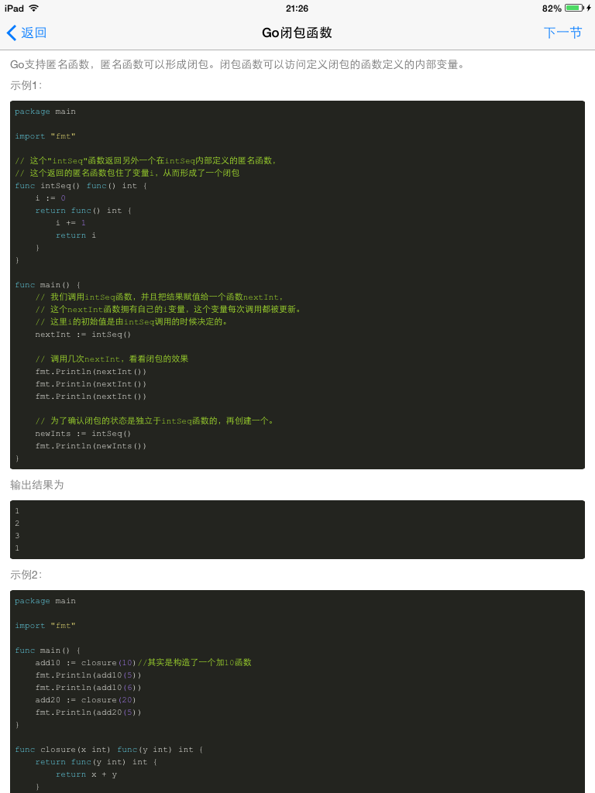
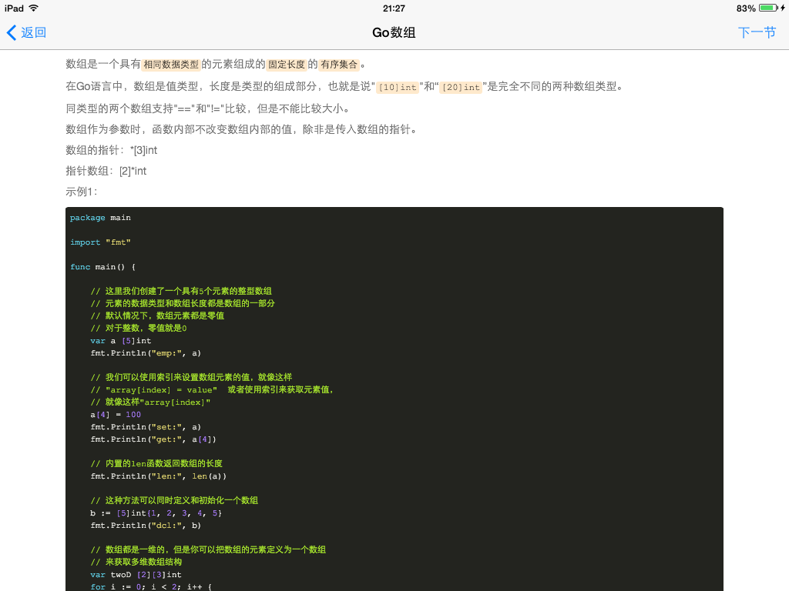

GolangStudy
===========

用Swift写的Golang学习App。

素材及内容来自[https://github.com/jemygraw/GoQuickLearn-iOS](https://github.com/jemygraw/GoQuickLearn-iOS)。

感谢[jemygraw](https://github.com/jemygraw) 开源objective-c版本源码。

# 知识点

UITableView、UISegmentedControl、UIWebView控件的使用及使用NSXMLParser解析XML。

# Screenshots

* iPad真机

# 应用安装

目前支持iOS7以上越狱的设备。可通过访问蒲公英应用广场搜索*Go轻松学*或[http://www.pgyer.com/7TU8](http://www.pgyer.com/7TU8)在线安装。

# License

MIT

Copyright (c) 2014 雪山飞鹄
